# Practica 2: Implementación de pilas dinámicas

Objetivo: Evaluación de la validación de uso de paréntesis y evaluación de expresiones en notaciones prefija, infija y posfija

### Parte I: Conocimiento previo: Notaciones prefijas, infijas y posfijas

#### Notación infija

En nuestro día a día hemos tenido la necesidad de realizar cálculos matemáticos, algunos muy chicos y otros más grandes, como por ejemplo la siguiente suma: 

2 + 3 = 5

La suma anterior resulta muy fácil de entender y de resolver, sin embargo la complejidad podría aumentar un poco si agregamos una multiplicación en la expresión, por ejemplo:

2 + 3 * 5 

La siguiente expresión empieza a ser ambigua ya que no nos dice concretamente si se tiene que hacer primero la suma de 2 + 3 y el resultado multiplicarlo por 5, o primero hacer la multiplicación de 5 * 3 y luego sumar al resultado 2. Sin embargo este problema se resulve con la jerarquía de los operadores, donde la jerarquía que tienen es la siguiente:

1. Potencias y raíces
2. Multiplicaciones, divisiones y módulos
3. Sumas y restas

Siguiente la jerarquía anterior mencionada, las potencias y raíces tiene la jerarquía más importante, después le siguen las multiplicaciones, divisiones y módulos, por último son las sumas y restas. Es importante añadir que para aplicar correctamente la jerarquía de operaciones, la expresión se debe de ir recorriendo de izquierda a derecha

Por lo tanto si la expresión pasada la dejamos tal como esta y la empezamos a realizar siguiendo la jerarquía de operaciones, el resultado sería el siguiente: 

Se recorre la expresión y nos damos cuenta que hay un operador de + y un operador de *, donde el operador de * (multiplicación) tiene mayor precedencia que el de +, por lo que se debe de ejecutar la multiplicación entre el número que esten a la izquierda y a la derecha del operador *, entonces hasta el momento la operación quedaría de la siguiente manera: 

2 + 3 * 5 = 2 + 15

Por jerarquía de operaciones, primero se hizó la multiplicación, por lo que la expresión resultante al momento es:

2 + 15

En este caso el único operador que queda es +, por lo que basta con hacer la suma entre los dos operandos, y el ejercicio queda resuelto, entonces el resultado final quedaría como sigue: 

2 + 15 = 17

El resultado de evaluar la expresión con ayuda de de la jerarquía de operaciones es: 

2 + 3 * 5 = 17

Sin embargo, como se dijo en un principio esta expresión resultaba un poco ambigua, porque no decia explicitamente que operación era la que se tenía que hacer primero, se pudo resolver con la jerarquía de operaciones, pero el problema cambia cuando tengo que ejecutar primero una operación con una jerarquía mas baja que las demás operaciones que haya en la operación.

Para hacer resolver esa problemática se hace uso un par de parentesis "( )", los paréntesis en muchas aplicaciones de las matemáticas son operadores de asociatividad, donde en el caso de las expresiones agrupa un conjuntos de operadores y operandos y les da una jerarquía superior que los demás operandos y operadores de la expresión, es decir retomando el ejemplo anterior, si necesitaramos forzosamente aplicar primero la suma de 2 + 3 y luego ese resultado multiplicarlo por 5, la forma en que tendríamos que escribir la expresión es la siguiente: 

(2 + 3) * 5 

Teniendo la operación 2 + 3 dentro del paréntesis, le indicamos que primero haga la suma de estos 2, operandós porque los paréntesis son operadores de asociatividad que tiene más jerarquía que los demás operadores, después el resultado se multiplica por 5, entonces el resultado quedaría de la siguiente forma: 

(2 + 3) * 5 = 6 * 5 = 30

Y el resultado es diferente a la primera donde no había operadores de asociatividad.

Esta forma de representar las operaciones se le conoce como notación infija, donde los operadores se encuentran en medio de los operandos.

Esta forma de expresar operaciones que queramos resolver a pesar de que es la que estamos acostumbrados a ver en la escuela, en los trabajos, etc, no es la más recomendable por el uso excesivo que pudiera llegar a haber sobre los parentesis, es por eso que se tienen dos notaciones más para representar las operaciones que se quiere realizar donde no se usan los paréntesis, pero la forma de la expresión es diferente a lo que estamos acostumbrados.

#### Notación prefija

En la notación prefija el operador esta escrito antes de los operandos sobre los cuales realizará dicha operación, por lo que el uso de los paréntesis no es necesario 

##### Ventajas

* No necesita paréntesis
* Al no necesitar paréntesis, no se necesitan agrupar en estructuras de datos.

##### Desventajas

* Díficil de leer si no se tiene práctica sobre el tema

Algunos usos tanto de las notaciones prefijas y las notaciones posfijas es en :

* lenguajes de programación como Lisp o schem
* Compiladores: Los compiladores convierten las expresiones que estan escritas en notación infija a notación prefija o posfija esto para hacer las cálculos correctos durante el proceso de compilación
* Sistemas embebidos: Son dispositivos para un objetivo específico en el cual los recursos son limitados, por lo que el utilizar expresiones en notación infija son útiles para reducir el número de dígitos de la expresión y el número de estructuras de datos.
* Calculadoras: Convierten las expresiones infijas a prefijas para poder realizar los cálculos correctamente

#### Notación posfija

Son las expresiones en las que los operadores aparecen después de los operandos a los cuales se les aplicará la operación que se desea hacer.

En cuanto a sus ventajas y aplicaciones son las mismas que las notaciones prefijas

#### Conversión entre notaciones

En general para pasar expresiones matemáticas en los diferentes tipos de notaciones utiliza en su algoritmo una estuctura de datos tipo pila, sin embargo en este resumen solo te voy a dar un algoritmo para pasar de una expresión en infija a su forma en posfija, el cual el utiliza una pila, dado que ya sabemos como una funciona una pila, y que sus operaciones básicas para su funcionamiento son push (para insertar elementos) y pop (para eliminar el elemento de la pila) y que también sabemos sobre la jerarquía de los operadores, voy a dar el siguiente algoritmo para dicha conversión:

Dada una expresión en infija se recorre dicha expresión y se hacen los siguientes pasos: 

- Si el elemento actual es un operando, se escribe como parte de la expresión que será su traducción en posfija.

- Si el elemento actual es un parentesis izquierdo se hace push del paréntesis en la pila

- Si el elemento actual es un paréntesis derecho se hace aplica la operación de peek o top para obtener el valor de la cima de la pila, después se aplica pop, esto se hace hasta encontrar el paréntesis izquierdo, después de hacer esto el paréntesis también se debe de quitar de la pila, pero no se debe de agregar a la expresión que lleva la forma final ya que recordemos que las notaciones prefijas y posfijas no necesitan paréntesis.

- Si el elemento actual es un operador, se hace push del operador en la pila, sin embargo se tienen que sacar de la pila todos los operadores que tiene mayor o igual jerarquía que el operador actual que se esta revisando

- Si al final de haber recorrido toda la expresión hay elementos en la pila, se debe de hacer peek para obtener su valor de la cima y agregarlo a la salida, esto se hace hasta que la pila este vacía

Ejemplo sencillo de una conversión de una expresión de notación infija a posfija
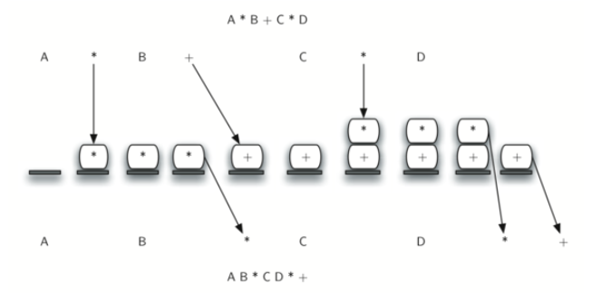

#### Evaluación de una expresión en notación posfija

Dada una expresión en notación posfija, para poderla evaluar se hace uso de una estructura de datos tipo pila, siguiente el siguiendo algoritmo:

Recorrer la expresión de izquierda a derecha:

- Si el elemento actual corresponde a un operando hacer push del operando en una pila.

- Si elemento actual es un operador, hacer peek y después pop en la pila, el primer peek que se haga correspondera al segundo operando, o también conocido como operando derecho, mientras que el segundo peek correspondera al primer operando, o también conocido como el operando izquierdo, cuando ya tenemos los operandos que se van a ocupar, pues se hace la operacion que se tenga que hacer dependiendo del operador actual que se está recorriendo en la expresión, después de haber hecho la operación correspondiente se hace push del resultado en la pila, y se sigue recorriendo la expresión

- Después de haber recorrido toda la expresión en la pila habrá un elemento que correspondera al resultado final de haber procesado y evaluado toda la expresión hacer peek para obtener ese valor, y después pop() para vaciar la pila, y recuperar la memoria, y este valor será el resultado de haber procesado toda la expresión.

Ejemplos de evaluación de expresiones que estan en notación posfija
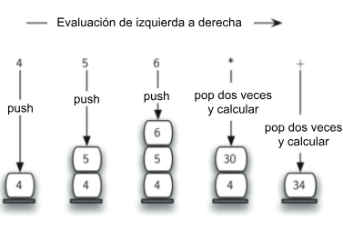

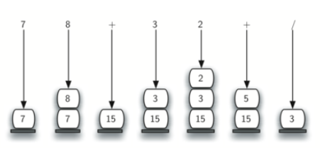

##### Parte II: Conversión de notación infija a posfija 

Anteriormente ya se dio el algoritmo para implementar esa funcionalidad, sin embargo el algoritmo escrito con puras palabras, puede llegar a ser díficil de entender, por lo que hice un pseudocódigo que corresponde a la implementación que hice, el cual es el siguiente: 

string infija_posfija(string infija)

{
    
    salida <-- ""
    for i=0;i<infija.size();i++>

        si isDigit(infija[i]) entonces:
            salida <-- salida + infija[i]
        sino si infija[i] == '(' entonces:
            push(infija[i])
        sino si infija[i] == ')' entonces: 
            mientras top() != '(')
                salida <-- salida + top()
                pop()
            Fin mientras
            pop()
        sino si infija[i] == '+' || infija[i] == '-' entonces:
            mientras numElementos != 0 && top() != '('
                salida <-- salida + top()
                pop()
            Fin Mientras
            push(infija[i])
        sino si infija[i] == '*' || infija[i] == '/' || infija[i] == '%'
            mientras numElementos != 0 and (top() == '*' || top() == '/' || top() == '%')
                salida <-- salida + top()
                pop()
            Fin Mientras
            push(infija[i])
        sino
            mientras(numElementos != 0 and top() != '^')
                salida <-- salida + top()
                pop()
            Fin Mientras
            push(infija[i])

        mientras numElementos != 0
            salida <-- salida + top()
            top()
        Fin Mientras

    return salida            
}

En mi opinión la parte un poco más díficil de entender como funciona es cuando al recorrer la expresión nos encontramos con un operador, por lo que la voy a explicar, cuando se recorre la expresión y se encuentra con un operador de suma o resta que tienen el mismo nivel de jerarquía, se hace lo siguiente: 

Se revisa si la pila esta vacía, en caso de que este vacía se hace push del operador en la pila, en caso de que no este vacía, se hace peek y pop de todos los elementos hasta encontrar un parentesis izquierdo en caso de se haya introducido una expresión con paréntesis y haya por lo menos un elemento, en la pila, esto se hace porque recordemos que el agoritmo de arriba mencionaba que para aplicar está operación era necesario hacer peek y pop de los operadores de mayor o igual jerarquía, dado que la suma y resta son los operadores de menor jerarquía, pues se tendrá que repetir estos pasos hasta que se encuentre un paréntesis izquierdo o por lo menos haya un elemento en la pila

Cuando el operador que se está revisando es un operador de multilicación, división o módulo (*, /, % respectivamente), entonces, se hace lo siguiente: 

Primero revisa si hay elementos en la pila, en caso de que no haya, pues se hace push del operador actual, en caso de que haya elementos en la pila, se hace lo siguiente: que mientras el número de elementos de la pila sea diferente de 0, y el operador sea igual a operadores de la misma o mayor jerarquía (que en este caso serían los operadores de *, /, %, ^) se hace peek y pop de todos los elementos, esto es porque en caso de que no haya paréntesis en la expresión pues cabe la posibilidad de que se llegue a un número de elementos de 0 en la pila, y para ya no hacer eliminaciones donde ya no hay elementos es por eso que se pone que se ejecuten mientras el número de elementos sea diferente de 0, y mientras el operador actual de la pila que se está revisando sea igual a *, /, % o ^, ya que estos son operadores de mayor o igual jerarquía que *, /, % y ^, cuando se detenga esto, entonces se hace push del operador de la expresión que se está recorriendo actualmente.

Por último si no se cumple, algunas de las sentencias selectivas anteriores, damos por entendido, que entonces el operador actual es un operador de potencia (^), entonces, dado que este operador es el de mayor jerarquí en los operadores, se hace lo siguiente:
mientras haya elementos en la pila y el operador actual de la pila sea igual a un operador de la misma jerarquía o una mayor jerarquía que en este caso solo puede ser el operador ^ haga peek y pop de los elementos en la pila, después de que se detenga el ciclo, se tendrá que hacer push del operador de la expresión que se está revisando actualmente.

Al final de revisar la expresión, se verifica si la pila todavía contiene operadores, en caso de que tenga operadores, se hace peek y pop de todos los operadores y se agregan a la cadena de salida, la forma en como se agregan a la cadena de salida es así comforme se hacen los peeks y los pop.

Al final se retorna la cadena en expresión posfija:

##### Parte 3: Evaluación de una expresión en notación posfija.

Dada una expresión matemática escrita en notación posfija se recorre la cadena de izquierda a derecha y se sigue el siguiente algoritmo: 

evaluacionPosfija(posfija):

{

    Pila *pilaOperandos = new Pila()
    
    for(i=0;i<posfija.size();i++)
        si(posfija[i]) == 0, 1, 2, ..., 9 entonces
            pilaOperandos->push(posfija[i])
          sino si posfija[i] == '+' entonces
            aplicarSuma()
          sino si posfija[i] == '-' entonces
            aplicarResta()
          sino si posfija[i] == '*' entonces
            aplicarMultiplicacion()
          sino si posfija[i] == '/' entonces
            aplicarDivision()
          sino si posfija[i] == '%' entonces
            aplicarModulo()
          sino
            aplicarPotencia()
        Fin SI

    Fin del ciclo for

    resultado <- top()

    delete tope

    return resultado

}

aplicarSuma()

{

    operando2 <- top()
    pop()
    operando1 <- top()
    pop()
    suma <- operando1 + operando2
    pilaOperandos->push(suma)
}

aplicarResta()

{

    operando2 <- top()
    pop()
    operando1 <- top()
    pop()
    resta <- operando1 - operando2
    pilaOperandos->push(resta)
}

aplicarMultiplicacion()

{

    operando2 <- top()
    pop()
    operando1 <- top()
    pop()
    multiplicacion <- operando1 * operando2
    pilaOperandos->push(multiplicacion)
}

aplicarDivision()

{

    operando2 <- top()
    pop()
    operando1 <- top()
    pop()
    division <- operando1 / operando2
    pilaOperandos->push(division)
}

aplicarModulo()

{

    operando2 <- top()
    pop()
    operando1 <- top()
    pop()
    modulo <- operando1 % operando2
    pilaOperandos->push(modulo)
}

aplicarPotencia()

{

    operando2 <- top()
    pop()
    operando1 <- top()
    pop()
    potencia <- operando1 ** operando2
    pilaOperandos->push(potencia)
}

El algoritmo anterior se traduce a las siguientes instrucciones.

Se recorre la expresión de izquierda a derecha, si el elemento actual que se está procesando es un digito(operando) se hace push del operando en la pila, si elemento actual es un operador se hace top() y pop() en la pila dos veces, el primer top() corresponde al segundo operando mientras que el segundo top() corresponde al primer operandos, despues de que se hacen estas operaciones sobre la pila, los operandos se operan con el operador que se haya encontrado y se hace push del resultado en la pila.

Al final de haber recorrido toda la expresión quedará solamente un elemento en la estructura, dicho elemento corresponde al resultado de haber evaluado la expresión anterior en notación posfija, por lo que se tiene que hacer top() para recoger el valor y pop() para eliminar ese espacio de memoria, y finalmente se ha evaluado la expresión en notación posfija

Algunos ejemplos de evaluación de expresión en notación posfija son los siguientes: 

##### Ejemplos de aplicación del algoritmo anterior en una implementación elaborada en lenguaje C++

Primer ejemplo: Se tiene (3*(4+5)*(7-2)) da los siguientes resultados que se muestra en la imagen

Los algoritmo anteriores tanto para hacer la conversión de la expresión de notación infija a notación posfija se implementarón en lenguaje C++, se probo el algoritmo con 4 expresiones y los resultados que arrojo fueron los siguientes: 

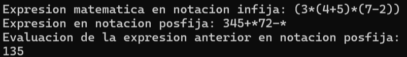

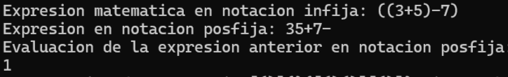

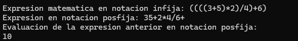

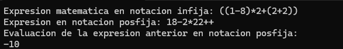

Dichos resultados se pueden corroborar con ayuda del siguiente link que te envía a una página que hace conversiones de expresiones de notación infija a notaciones posfijas:

https://www.sas.com.ru/wp/es/preobrazovatel-prostogo-infiksa-v-postfiks-ili-prefiks/

#### Parte 4: Balanceo de paréntesis

Otra aplicación de la estructuras de datos de tipo pila, es la verificación del balanceo de paréntesis en una expresión: 

Para este ejercicio solamente se usaron expresiones que tengan únicamente operadores de agrupación que son los siguientes: corchete "[]", paréntesis "()" y llaves "{}", y para probar que una expresión este balanceada en su número de paréntesis se siguió el siguiente algoritmo: 

balanceoParentesis(expresion)

{

    Pila pilaParentesis = new Pila()
    balanceo <- True

    for(i=0;i<expresion.size();i++)
    {
        si expresion[i] == "[" || expresion[i] == "(" || expresion[i] == "{" entonces
            pilaParentesis->push(expresion[i])
          sino si expresion[i] == "]" entonces
            si pilaParentesis->top() != "[" entonces
                balanceo <- False
                break
          sino si expresion[i] == ")" entonces
            si pilaParentesis->top() != "(" entonces 
                balanceo <- False
                break
          sino
            si pilaOperandos->top() != "{" entonces
                balanceo <- False
                break;
        Fin SI

    }

    return balanceo
}

El siguiente algoritmo se traduce a lo siguiente:

Se recorre la expresión de izquierda a derecha, si elemento actual que se está recorriendo es un operador de agrupación que abre, ("(", "[", "{") se hace push del operador de agrupación en la pila, y si se trata de un operador de agrupación de cierre, se hace top() en la pila, si elemento del cual se hizo top() corresponde al operador de agrupación izquierdo del mismo tipo con el operador que se está analizando en ese momento se sigue recorriendo la expresión, en caso contrario se rompe el ciclo porque en automático la expresión ya no estaría equilibrada, y en este caso retornamos un valor booleano

El algoritmo se probo con 4 expresiones de paréntesis, 2 de ellas si están balanceadas y las otras 2 no, y en efecto el algoritmo lanza el resultado correcto en cuanto a su balance, las pruebas están en la siguientes imágenes: 

Primer Ejemplo:

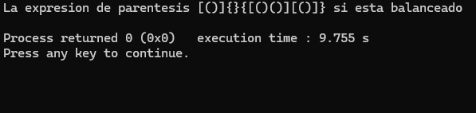

Segundo ejemplo:

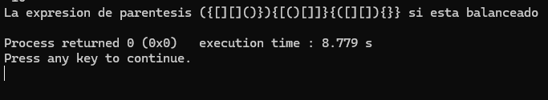

Tercer ejemplo

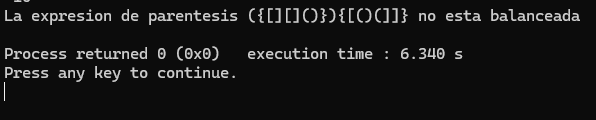

Cuarto ejemplo

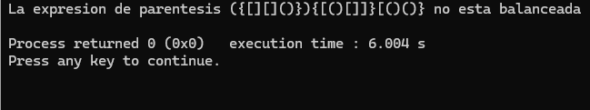
